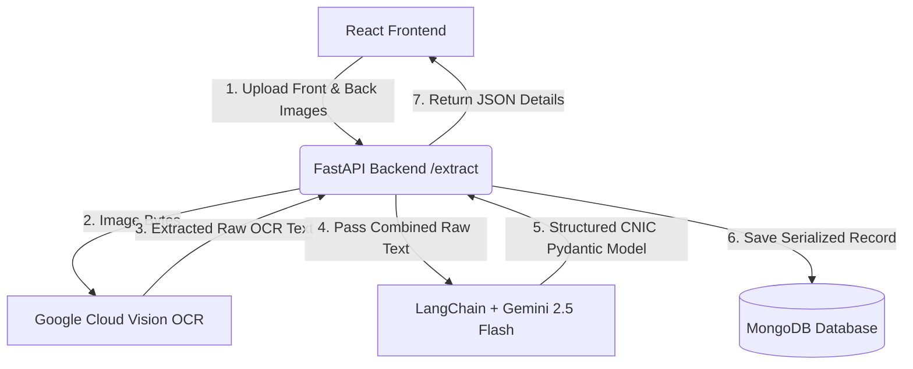

# CNIC.io - Pakistani CNIC Parser & OCR Service

CNIC.io is a modern, full-stack, AI-powered identity card parsing application. It is designed to automatically extract structured data from Pakistani Computerized National Identity Cards (CNICs). By uploading the front and back images of a CNIC, the system performs optical character recognition (OCR) and utilizes a Large Language Model (LLM) to extract information into structured formats before storing them in a MongoDB database.

---

## 🛠️ Tech Stack

### Backend
- **Framework:** FastAPI (Python)
- **OCR Engine:** Google Cloud Vision API
- **LLM Integration:** LangChain & Gemini (using `gemini-2.5-flash`)
- **Database:** MongoDB Atlas (asynchronous driver via `motor` and `pymongo`)
- **Validation:** Pydantic

### Frontend
- **Framework:** React 19 + Vite
- **Styling:** Tailwind CSS v4
- **Animations:** Framer Motion (for futuristic micro-animations and smooth transition effects)
- **Icons:** Lucide React

---

## 📐 Architecture Workflow

The flow of processing images from the user interface to database storage is summarized below:



---

## ✨ Key Features

- **Double-Sided Image Upload:** Clean, drag-and-drop dual upload zones for both front and back sides of the CNIC.
- **Robust OCR Text Extraction:** Leveraging Google Cloud Vision API to reliably read text from varying image qualities and orientations.
- **LLM-Powered Data Extraction:** Uses Gemini 2.5 Flash with structured output formatting to parse unstructured raw text into structured fields:
  - Full Name
  - Father's/Husband's Name
  - CNIC Number (with/without formatting)
  - Gender
  - Date of Birth
  - Date of Issue
  - Date of Expiry
  - Address
- **Asynchronous Storage:** Saves processed records to a MongoDB database instantly.
- **Futuristic UI/UX:** A rich, premium dark-themed interface built using Tailwind CSS v4 and Framer Motion, complete with animated scanning states, custom validation, result cards, and empty state templates.

---

## 📋 Prerequisites

Before running the project locally, ensure you have:
1. **Python 3.10+** installed.
2. **Node.js 18+** installed.
3. A running instance of **MongoDB** (local or MongoDB Atlas cluster).
4. A **Google Cloud Project** with the **Cloud Vision API** enabled, and a service account credentials JSON key file downloaded.
5. A **Google AI Studio / Gemini API Key**.

---

## 🚀 Getting Started

### 1. Backend Setup

Navigate to the `backend` directory:
```bash
cd backend
```

1. **Create and Activate Virtual Environment:**
   ```bash
   python -m venv .venv
   # On Windows:
   .venv\Scripts\activate
   # On macOS/Linux:
   source .venv/bin/activate
   ```

2. **Install Dependencies:**
   ```bash
   pip install -r requirements.txt
   ```

3. **Configure Environment Variables:**
   Create a `.env` file in the `backend` folder using the following template:
   ```env
   MONGO_URI=your_mongodb_connection_string
   MONGO_DB_NAME=cnic_db
   MONGO_COLLECTION_NAME=cnic_records
   GOOGLE_API_KEY=your_gemini_api_key
   GOOGLE_APPLICATION_CREDENTIALS=path_to_your_google_cloud_vision_key.json
   MAX_IMAGE_SIZE_MB=10
   ```
   > [!IMPORTANT]
   > Place your Google Cloud Vision credentials key file (e.g., `vision-key.json`) in the `backend/` directory and point `GOOGLE_APPLICATION_CREDENTIALS` to its path.

4. **Run the FastAPI Application:**
   ```bash
   uvicorn app.main:app --reload
   ```
   The backend will be running on `http://localhost:8000`.

---

### 2. Frontend Setup

Navigate to the `frontend` directory:
```bash
cd frontend
```

1. **Install Dependencies:**
   ```bash
   npm install
   ```

2. **Configure Environment Variables:**
   Create a `.env` file in the `frontend` folder:
   ```env
   VITE_API_BASE_URL=http://localhost:8000
   VITE_ENABLE_DEMO_MODE=false
   VITE_MAX_FILE_SIZE_MB=10
   ```

3. **Run the React Dev Server:**
   ```bash
   npm run dev
   ```
   Open your browser and navigate to the address shown (usually `http://localhost:5173`).

---

## 📡 API Endpoints

FastAPI automatically serves interactive OpenAPI documentation at `http://localhost:8000/docs`. Here is a summary of the main endpoints:

| Endpoint | Method | Description | Request Body / Parameters |
| :--- | :---: | :--- | :--- |
| `/` | `GET` | Health check endpoint | N/A |
| `/extract` | `POST` | Core extraction endpoint (returns basic CNIC fields and saves to DB) | Form-data: `front_image` (File), `back_image` (File) |
| `/cnic/upload` | `POST` | Upload and process CNIC (returns standard envelope response with `CNICResponse`) | Form-data: `front_image` (File), `back_image` (File) |
| `/cnic/records` | `GET` | List all scanned CNIC records saved in the database | N/A |
| `/cnic/record/{id}` | `GET` | Fetch details of a single record by its Database ID | Path parameter: `id` (string) |

---

## 🌐 Deployment Options

Since this project contains a Python backend service, it is ideal to host it on platforms that support running active servers (unlike pure static hosting like Vercel). 

Detailed setup instructions for various providers are documented in our [Deployment Guide](file:///C:/Users/zawar/.gemini/antigravity-ide/brain/d0801b18-2edc-4667-b213-6902cfa59a51/deployment_guide.md). Here is a quick overview of the available methods:

### 1. Render.com (Recommended Free Alternative)
- **Backend:** Deploy as a **Web Service** using Python 3 or our `backend/Dockerfile`. Set up your environment variables (`MONGO_URI`, `GOOGLE_API_KEY`, etc.) and upload your `vision-key.json` as a **Secret File**.
- **Frontend:** Deploy as a **Static Site** reading from your Render backend API URL. Add a rewrite rule for `/* -> /index.html` to support React.

### 2. Railway.app (Easy Docker Setup)
- Railway will automatically detect the `backend/Dockerfile` and `frontend/Dockerfile` when you deploy the folders. Set up the matching environment variables, and you're good to go.

### 3. VPS Deployment (Docker Compose)
A production-grade `docker-compose.yml` is included in the root directory. To launch the frontend, backend, and a database instance altogether on your own Linux server, simply run:
```bash
docker-compose up --build -d
```

---

## 📂 Project Structure

```
Cnic-Parser/
├── backend/
│   ├── app/
│   │   ├── config/       # Application configuration & env settings
│   │   ├── models/       # Pydantic schemas (CNICData, CNICRecord)
│   │   ├── routes/       # API router endpoints
│   │   ├── services/     # OCR (Vision API), LLM (Gemini), and Storage (MongoDB) logic
│   │   ├── database.py   # MongoDB Connection Client
│   │   └── main.py       # FastAPI Entry Point
│   ├── requirements.txt  # Python Dependencies
│   ├── Dockerfile        # Container build definition for backend
│   └── README.md         # Backend Documentation
│
├── frontend/
│   ├── src/
│   │   ├── components/   # Modular UI elements (UploadCard, ResultCard, etc.)
│   │   ├── pages/        # Main landing page (Home.jsx)
│   │   ├── App.jsx       # Root React Component
│   │   └── main.jsx      # React DOM hydration
│   ├── package.json      # Frontend Dependencies
│   ├── vite.config.js    # Vite configuration
│   ├── Dockerfile        # Container build definition for frontend
│   ├── nginx.conf        # Production Nginx configuration
│   └── README.md         # Frontend Documentation
│
├── docker-compose.yml    # Root Docker orchestration config
└── README.md             # Project Root Readme (This File)
```

